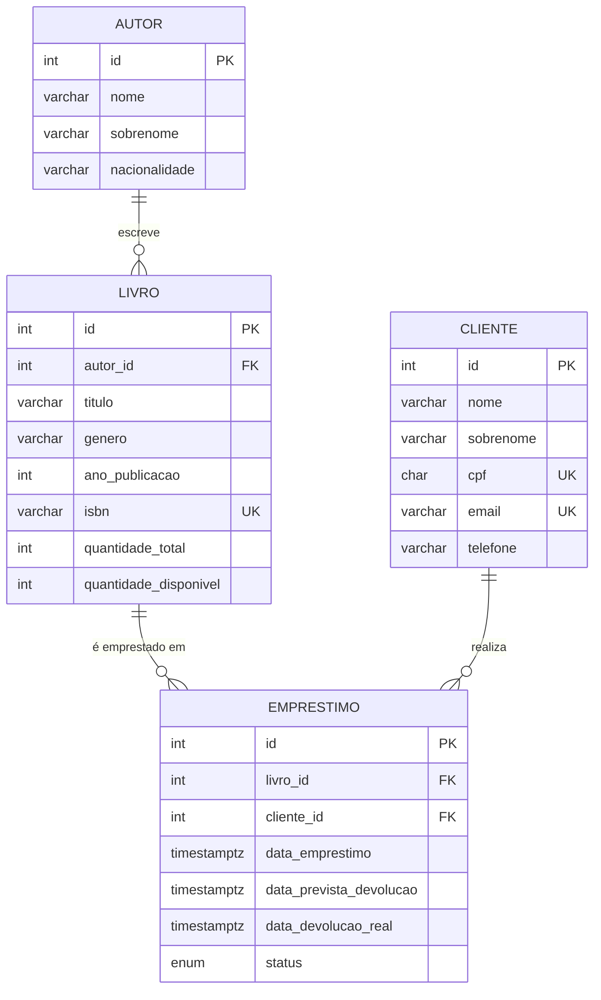

# BookStore Manager CLI

Projeto Final Avaliativo - Módulo 01 - Semana 13 - SCTEC Back End Node T1/T2.

Aplicação CLI para gerenciamento de uma livraria (autores, livros, clientes e empréstimos), utilizando Node.js, TypeScript e PostgreSQL.

> Em desenvolvimento.

## Modelagem do Banco de Dados

Esta modelagem descreve o banco de dados da aplicação: as 4 entidades mínimas exigidas pelo
enunciado (Autores, Livros, Clientes, Empréstimos), seus campos e os relacionamentos entre elas
através de chaves primárias e estrangeiras.




### Relacionamentos

- **Autor → Livro** (1:N): um autor pode ter vários livros; cada livro tem exatamente um autor.
- **Livro → Empréstimo** (1:N): um livro pode ser emprestado várias vezes ao longo do tempo (em momentos diferentes).
- **Cliente → Empréstimo** (1:N): um cliente pode ter vários empréstimos, atuais e passados.

**OBSERVAÇÃO (regra de negócio):** um livro só pode ser emprestado se `quantidade_disponivel > 0`;
uma devolução deve encerrar o empréstimo ativo (`status = 'devolvido'`) e devolver o exemplar ao
acervo (`quantidade_disponivel + 1`). Garantir essa regra é o motivo central de existir uma
camada de `service` separada do `controller` e do `repository` — é lá que essa validação
acontece antes de qualquer escrita no banco.

Script completo em [`src/database/schema.sql`](src/database/schema.sql).

## Objetivos

- Gerenciar autores, livros, clientes e empréstimos via terminal.
- Persistir os dados em um banco PostgreSQL, com regras de negócio aplicadas antes de qualquer escrita (ex.: livro precisa de autor cadastrado, empréstimo exige disponibilidade).
- Disponibilizar relatórios estratégicos a partir de consultas relacionais (JOIN, GROUP BY, agregações).

## Tecnologias

- Node.js + TypeScript (modo `strict`)
- [`pg`](https://node-postgres.com/) para acesso ao PostgreSQL (queries parametrizadas, sem ORM)
- `dotenv` para configuração de ambiente
- ESLint + Prettier

## Arquitetura

```
src/
├── main.ts            # Ponto de entrada: conecta ao banco e inicia o menu principal
├── menus/              # Navegação entre telas/opções do CLI
├── controllers/        # Interação com o terminal (leitura de input, exibição de saída)
├── services/            # Regras de negócio e validações
├── repositories/        # Acesso a dados via `pg` (queries parametrizadas)
├── models/              # Classes e interfaces das entidades
├── database/            # Conexão (pool) e schema.sql
├── utils/                # Funções auxiliares (readline, validadores)
└── errors/               # Classes de erro customizadas (ValidationError, NotFoundError)
```

Fluxo de dependências: `main.ts` → `menus` → `controllers` → `services` → `repositories` → banco de dados.

## Instalação e execução

### Pré-requisitos

- Node.js 18+
- PostgreSQL 14+ em execução

### Passo a passo

1. Instale as dependências:

   ```bash
   npm install
   ```
2. Copie o arquivo de variáveis de ambiente e ajuste com as credenciais do seu PostgreSQL:

   ```bash
   cp .env.example .env
   ```
3. Crie o banco de dados e aplique o schema:

   ```bash
   createdb bookstore_manager
   psql -d bookstore_manager -f src/database/schema.sql
   ```
4. Execute a aplicação em modo desenvolvimento:

   ```bash
   npm run dev
   ```

   Ou compile e execute a versão de produção:

   ```bash
   npm run build
   npm start
   ```

## Funcionalidades implementadas

- [X] Cadastro, listagem, consulta, atualização e remoção de autores
- [ ] Gerenciamento de livros
- [ ] Gerenciamento de clientes
- [ ] Empréstimos e devoluções
- [ ] Relatórios

## Exemplo de uso

```text
=== BookStore Manager CLI ===
1. Autores
2. Livros (em breve)
3. Clientes (em breve)
4. Empréstimos (em breve)
5. Relatórios (em breve)
0. Encerrar aplicação
Escolha uma opção: 1

--- Menu Autores ---
1. Cadastrar autor
2. Listar autores
3. Consultar um autor
4. Atualizar autor
5. Remover autor
0. Voltar
Escolha uma opção: 1
Nome: João
Sobrenome (opcional): Silva
Nacionalidade (opcional): Brasileira
Autor cadastrado com sucesso:
#1 - João Silva | Nacionalidade: Brasileira
```

## Melhorias futuras

- **Permitir mais de um autor por livro**: hoje cada livro só pode ter um autor
  cadastrado (o campo `autor_id` só guarda um id). Pesquisando um pouco, vi que
  pra fazer isso direito precisaria de uma tabela nova no meio (`livro_autor`)
  ligando livros e autores em N:N, ao invés da chave estrangeira simples que
  tenho hoje. Não cheguei a implementar porque não era um requisito do projeto
  e mexeria em várias partes do código (cadastro, edição, tela de seleção), mas
  fica registrada a ideia pra uma próxima versão.

## Integrantes

- Walquiria de Oliveira (projeto individual)
